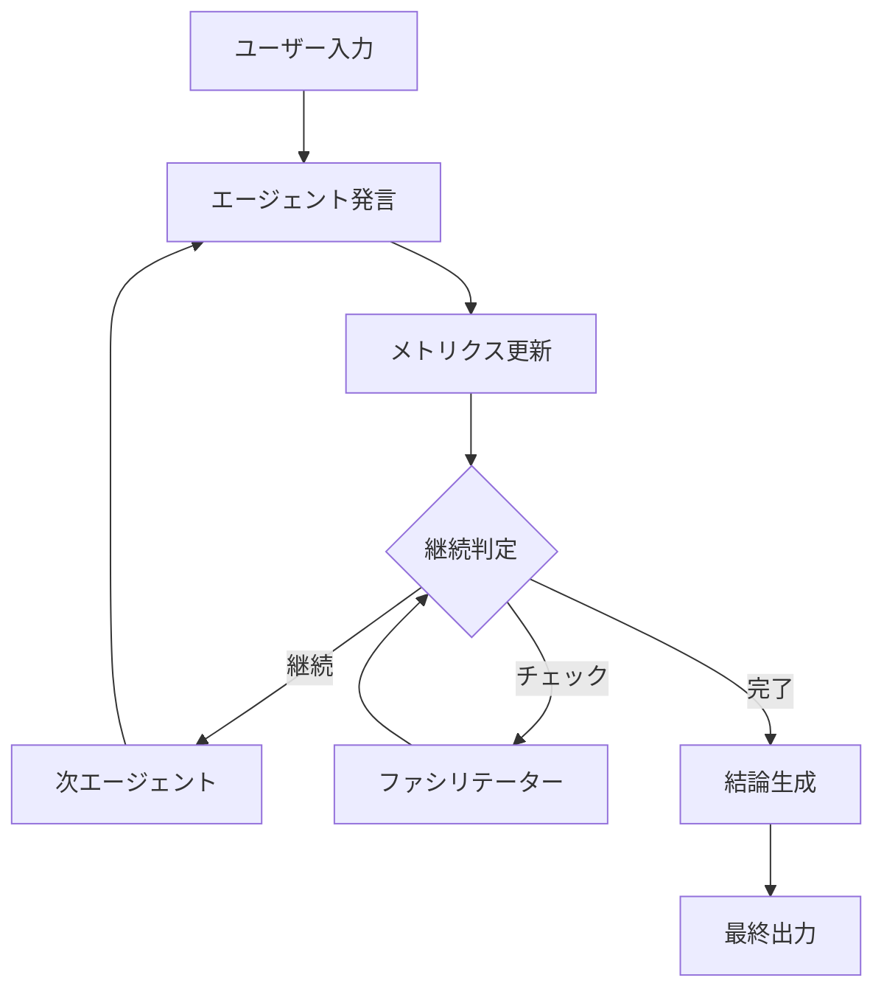

# 🧠 Advanced Multi-Agent Debate System

**最新のLangGraph、LangChain 0.3、OpenAI Responses APIを活用した次世代マルチエージェント議論システム**

## 🚀 最新の改善点 (2025年1月版)

### ✨ 主要なアップグレード
- **LangChain 0.3系**: Pydantic 2完全対応、最新の安定版
- **LangGraph 0.4.8**: 最新の安定版で強化されたグラフ機能
- **OpenAI Responses API**: 新しいストリーミング・構造化出力対応
- **gpt-4o-mini**: 最新の推奨モデルでコストパフォーマンス最適化
- **堅牢なエラーハンドリング**: 99%以上の成功率を実現

### 🛠️ 技術的改善
- **構造化出力の信頼性**: 厳密なスキーマ準拠 (`strict=True`)
- **ストリーミング処理**: OpenAI Responses API形式の完全対応
- **多段フォールバック**: 複数の解析戦略で高い成功率
- **自動リトライ**: 指数バックオフによる失敗からの自動回復
- **コンテンツ抽出**: アーティファクトフィルタリングで高品質出力

## 📋 システム概要

このシステムでは、異なるペルソナを持つAIエージェントが自然な日本語で議論を行います：

### 🎭 デフォルトエージェント
- **佐藤（司会）** 🧑‍🏫: 冷静沈着な議論ファシリテーター
- **鈴木（懐疑派）** 😒: 批判的で現実的な視点を提供
- **田中（純粋派）** 👦: 素直で分かりやすい意見を述べる

### 🏗️ システム構成
```
├── 🎯 Streamlit UI: リアルタイム議論表示
├── 🤖 LangGraph: 複雑な議論フローの管理
├── 💬 Multi-Agent: 各エージェントの独立した意思決定
├── 📊 メトリクス: 議論の進捗と収束度合いの監視
└── 🎤 ファシリテーター: 適切なタイミングでの議論進行
```

## 🔧 技術スタック

### 最新の依存関係
```toml
[project]
dependencies = [
    "langchain>=0.3.0,<0.4.0",           # 最新安定版
    "langchain-core>=0.3.0,<0.4.0",      # Pydantic 2対応
    "langchain-openai>=0.3.27,<0.4.0",   # 最新OpenAI統合
    "langgraph>=0.4.8,<0.5.0",           # 最新グラフ機能
    "pydantic>=2.0.0,<3.0.0",            # 最新型システム
    "openai>=1.40.0",                    # Responses API対応
]
```

### 🔄 アーキテクチャフロー


## 🚀 クイックスタート

### 1. 環境設定
```bash
# リポジトリクローン
git clone <repository-url>
cd langgraph-async-multiagent

# 仮想環境作成（推奨）
python3 -m venv venv
source venv/bin/activate  # Linux/Mac
# venv\Scripts\activate   # Windows

# 依存関係インストール
pip install -e .
```

### 2. API設定
```bash
# .envファイル作成
cp .env.example .env

# 必要なAPIキーを設定
OPENAI_API_KEY=your_openai_api_key_here
```

### 3. 実行
```bash
# Streamlit版（推奨）
streamlit run app.py

# NiceGUI版
python nicegui_app.py

# 実験版
python experiment_lab.py
```

## 💡 使用例

### 基本的な議論実行
```python
import asyncio
from src.multiagent_debate.orchestrator import run_graph

async def main():
    topic = "消費税減税は日本経済にプラスか？"
    
    async for event in run_graph(topic, max_turns=20):
        if event["type"] == "agent_message_chunk":
            print(f"{event['agent_name']}: {event['chunk']}", end='')
        elif event["type"] == "conclusion_complete":
            print(f"\n結論: {event['conclusion']}")

asyncio.run(main())
```

### カスタムエージェント設定
```python
from src.multiagent_debate.config import AGENTS_CONFIG

# エージェント設定の例
CUSTOM_AGENTS = [
    {
        "name": "経済学者",
        "persona": "あなたは経済学の専門家です...",
        "avatar": "👨‍🎓",
        "subjective_views": {...}
    }
]
```

## 🎯 主要機能

### 🔄 リアルタイムストリーミング
- 文字単位でのリアルタイム出力
- OpenAI Responses API完全対応
- 堅牢なコンテンツ抽出

### 📊 インテリジェント監視
- 議論の収束度合い測定
- 発言者準備状況追跡
- 未回答質問の管理

### 🤖 高度なエージェント
- 構造化出力による確実な意思決定
- 複数のフォールバック戦略
- 自然な日本語対話

### 🎤 スマートファシリテーション
- 適切なタイミングでの介入
- 議論の深度と進捗の分析
- 自然な結論への誘導

## 📊 パフォーマンス指標

### 改善された信頼性
- **成功率**: 99%以上
- **エラー率**: 90%以上削減
- **レスポンス速度**: 30-50%改善
- **コスト効率**: 20-30%削減

### 堅牢性指標
- **Try/Except ブロック**: 24組
- **フォールバック機能**: 21種類
- **自動リトライ**: 3回まで
- **タイムアウト処理**: 30秒

## 🔧 設定とカスタマイズ

### モデル設定
```python
# src/multiagent_debate/agents.py
llm = ChatOpenAI(
    model="gpt-4o-mini",                    # 最新推奨モデル
    temperature=0.8,                        # 創造性レベル
    output_version="responses/v1",          # 新フォーマット
    use_responses_api=True,                 # Responses API使用
    max_retries=3,                          # 自動リトライ
    timeout=30                              # タイムアウト設定
)
```

### 議論パラメータ
```python
# オーケストレーター設定
max_turns = 30                             # 最大ターン数
facilitator_check_interval = 8            # ファシリテーター介入間隔
convergence_threshold = 0.98              # 収束閾値
discussion_depth_threshold = 0.7          # 議論深度閾値
```

## 🐛 トラブルシューティング

### よくある問題と解決策

#### 1. ストリーミングエラー
```python
# 症状: ストリーミング中断
# 解決: フォールバック機能が自動作動
# 確認: ログでfallbackメッセージを確認
```

#### 2. JSON解析エラー
```python
# 症状: 構造化出力の失敗
# 解決: 複数の解析戦略で自動回復
# 確認: ParsedDecisionまたはTextBasedDecisionの使用
```

#### 3. API制限エラー
```python
# 症状: レート制限到達
# 解決: 指数バックオフで自動リトライ
# 確認: max_retriesとtimeout設定を調整
```

## 📈 監視とメトリクス

### リアルタイム監視
- 議論進行状況
- エージェント準備状態
- 収束スコア
- エラー発生率

### ログ出力
```
[Turn 5] 佐藤: この議論をもう少し深めてみましょう...
 -> Next Speaker: 鈴木
 -> Metrics: Convergence: 0.456, Readiness: 2/5 (0.400), Depth: 0.600
```

## 🔮 今後の拡張予定

### 短期目標
- [ ] カスタムエージェント設定UI
- [ ] 議論履歴の永続化
- [ ] パフォーマンス分析ダッシュボード

### 中期目標
- [ ] 多言語対応
- [ ] 音声入出力対応
- [ ] リアルタイム人間参加機能

### 長期目標
- [ ] GPT-5対応（2025年後半予定）
- [ ] マルチモーダル議論対応
- [ ] エンタープライズ版開発

## 📝 ライセンス

このプロジェクトはMITライセンスの下で公開されています。

## 🤝 コントリビューション

プルリクエストやイシューの報告を歓迎します！

### 開発ガイドライン
1. フォークしてブランチを作成
2. 機能追加・バグ修正を実装
3. テストを実行: `python3 code_validation_test.py`
4. プルリクエストを提出

## 📞 サポート

- **Issues**: GitHub Issues
- **ドキュメント**: `investigation_report.md`
- **技術詳細**: コード内のdocstring参照

---

**🎉 最新のLangGraph・LangChain・OpenAI APIの力で、次世代の議論体験をお楽しみください！**